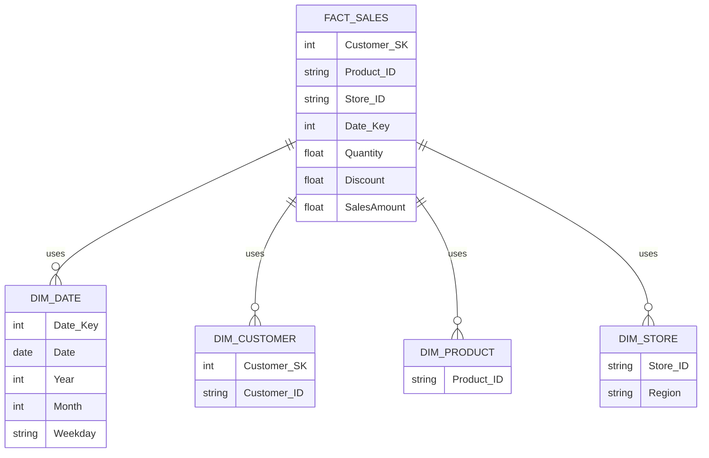

# The Data Warehouse Toolkit: The Definitive Guide to Dimensional Modeling, 3rd Edition

**By Ralph Kimball, Margy Ross**

* What is **Dimensional Modeling**?
* How is it importante for **Data Warehousing** and **Business Intelligence**?

The data warehousing and business intelligence (DW/BI) industry certainly has matured since Ralph Kimball published the first edition of The Data Warehouse Toolkit (Wiley) in 1996. Although large corporate early adopters paved the way, DW/BI has since been embraced by organizations of all sizes. The industry has built thousands of DW/BI systems. The volume of data continues to grow as warehouses are populated with increasingly atomic data and updated with greater frequency. Over the course of our careers, we have seen databases grow from megabytes to gigabytes to terabytes to petabytes, yet the basic challenge of DW/BI systems has remained remarkably constant. **Our job is to marshal an organization's data and bring it to business users for their decision making**. 

You establish a coherent design that serves the organization's analytic needs. This dimensionally modeled framework becomes the **platform for BI**. Dimensional modeling is absolutely critical to a successful DW/BI initiative.

This content shares the dimensional modeling patterns that have emerged repeatedly during the course of our careers. This book is loaded with specific, practical design recommendations based on real-world scenarios.

The goal of this book is to provide a one-stop shop for dimensional modeling techniques. True to its title, it is a toolkit of dimensional design principles and techniques.

This book is intended for data warehouse and business intelligence designers, implementers, and managers. In addition, business analysts and data stewards who are active participants in a DW/BI initiative will find the content useful.

Even if you're not directly responsible for the dimensional model, we believe it is important for all members of a project team to be comfortable with dimensional modeling concepts. The dimensional model has an impact on most aspects of a DW/BI implementation, beginning with the translation of business requirements, through the extract, transformation and load (ETL) processes, and finally, to the unveiling of a data warehouse through business intelligence applications. Due to the broad implications, you need to be conversant in dimensional modeling regardless of whether you are responsible primarily for project management, business analysis, data architecture, database design, ETL, BI applications, or education and support. We've written this book so it is accessible to a broad audience.

