# Data Warehousing, Business Intelligence, and Dimensional Modeling Primer

## Different Worlds of Data Capture and Data Analysis

One of the most important assets of any organization is its information. This asset is almost always used for two purposes: **operational record keeping** and **analytical decision making**. Simply speaking, the operational systems are where you put the data in, and the DW/BI system is where you get the data out.

Users of an operational system turn the wheels of the organization. They take orders, sign up new customers, monitor the status of operational activities, and log complaints. The operational systems are optimized to process transactions quickly. These systems almost always deal with one transaction record at a time. They predictably perform the same operational tasks over and over, executing the organization's business processes. Given this execution focus, operational systems typically do not maintain history, but rather update data to reflect the most current state.

Users of a DW/BI system, on the other hand, watch the wheels of the organization turn to evaluate performance. They count the new orders and compare them with last week's orders, and ask why the new customers signed up, and what the customers complained about. They worry about whether operational processes are working correctly. Although they need detailed data to support their constantly changing questions, DW/BI users almost never deal with one transaction at a time. These systems are optimized for high-performance queries as users' questions often require that hundreds or hundreds of thousands of transactions be searched and compressed into an answer set. To further complicate matters, **users of a DW/BI system typically demand that historical context be preserved to accurately evaluate the organization's performance over time.**

```mermaid
graph LR
    subgraph "OPERATIONAL LAYER (The Doing)"
        S[Sensors] -->|Fast Push| API[Ingestion API]
        API -->|High Throughput| K[(Message Broker / Kafka)]
    end

    K -.-> Boundary((THE DIVIDE))

    subgraph "ANALYTICAL LAYER (The Thinking)"
        Boundary --> SP[Stream Processor]
        SP -->|Calculates VPD| RD[(Real-time OLAP)]
        SP -->|Historical Load| DW[(Data Warehouse)]
        RD --> Dashboard[Agronomist Dashboard]
        DW --> AI[Yield Prediction Model]
    end

    %% High Contrast Styles
    style S fill:#d32f2f,stroke:#333,stroke-width:2px,color:#fff
    style API fill:#d32f2f,stroke:#333,stroke-width:2px,color:#fff
    style K fill:#d32020,stroke:#333,stroke-width:2px,color:#ff
    
    style RD fill:#1976d2,stroke:#333,stroke-width:2px,color:#fff
    style DW fill:#1976d2,stroke:#333,stroke-width:2px,color:#fff
    style Dashboard fill:#1976d2,stroke:#333,stroke-width:2px,color:#fff
    
    style Boundary fill:#000,stroke:#333,stroke-dasharray: 5 5

```

* “We collect tons of data, but we can't access it.”
* “We need to slice and dice the data every which way.”
* “Business people need to get at the data easily.”
* “Just show me what is important.”
* “We spend entire meetings arguing about who has the right numbers rather than making decisions.”
* “We want people to use information to support more fact-based decision making.”

Based on our experience, these concerns are still so universal that they drive the bedrock requirements for the DW/BI system. Now turn these business management quotations into requirements.

