# Data Warehousing, Business Intelligence, and Dimensional Modeling Primer

## Different Worlds of Data Capture and Data Analysis

One of the most important assets of any organization is its information. This asset is almost always used for two purposes: **operational record keeping** and **analytical decision making**. Simply speaking, the operational systems are where you put the data in, and the DW/BI system is where you get the data out.

Users of an operational system turn the wheels of the organization. They take orders, sign up new customers, monitor the status of operational activities, and log complaints. The operational systems are optimized to process transactions quickly. These systems almost always deal with one transaction record at a time. They predictably perform the same operational tasks over and over, executing the organization's business processes. Given this execution focus, operational systems typically do not maintain history, but rather update data to reflect the most current state.

Users of a DW/BI system, on the other hand, watch the wheels of the organization turn to evaluate performance. They count the new orders and compare them with last week's orders, and ask why the new customers signed up, and what the customers complained about. They worry about whether operational processes are working correctly. Although they need detailed data to support their constantly changing questions, DW/BI users almost never deal with one transaction at a time. These systems are optimized for high-performance queries as users' questions often require that hundreds or hundreds of thousands of transactions be searched and compressed into an answer set. To further complicate matters, **users of a DW/BI system typically demand that historical context be preserved to accurately evaluate the organization's performance over time.**

```mermaid
graph LR
    subgraph "OPERATIONAL LAYER (The Doing)"
        S[Sensors] -->|Fast Push| API[Ingestion API]
        API -->|High Throughput| K[(Message Broker / Kafka)]
    end

    K -.-> Boundary((THE DIVIDE))

    subgraph "ANALYTICAL LAYER (The Thinking)"
        Boundary --> SP[Stream Processor]
        SP -->|Calculates VPD| RD[(Real-time OLAP)]
        SP -->|Historical Load| DW[(Data Warehouse)]
        RD --> Dashboard[Agronomist Dashboard]
        DW --> AI[Yield Prediction Model]
    end

    %% High Contrast Styles
    style S fill:#d32f2f,stroke:#333,stroke-width:2px,color:#fff
    style API fill:#d32f2f,stroke:#333,stroke-width:2px,color:#fff
    style K fill:#d32020,stroke:#333,stroke-width:2px,color:#ff
    
    style RD fill:#1976d2,stroke:#333,stroke-width:2px,color:#fff
    style DW fill:#1976d2,stroke:#333,stroke-width:2px,color:#fff
    style Dashboard fill:#1976d2,stroke:#333,stroke-width:2px,color:#fff
    
    style Boundary fill:#000,stroke:#333,stroke-dasharray: 5 5

```

* “We collect tons of data, but we can't access it.”
* “We need to slice and dice the data every which way.”
* “Business people need to get at the data easily.”
* “Just show me what is important.”
* “We spend entire meetings arguing about who has the right numbers rather than making decisions.”
* “We want people to use information to support more fact-based decision making.”

Based on our experience, these concerns are still so universal that they drive the bedrock requirements for the DW/BI system. Now turn these business management quotations into requirements.

* **The DW/BI system must make information easily accessible.** The contents of the DW/BI system must be understandable. The data must be intuitive and obvious to the business user, not merely the developer. The data's structures and labels should mimic the business users' thought processes and vocabulary. Business users want to separate and combine analytic data in endless combinations. The business intelligence tools and applications that access the data must be simple and easy to use. They also must return query results to the user with minimal wait times. We can summarize this requirement by simply saying simple and fast.

* **The DW/BI system must present information consistently.** The data in the DW/BI system must be credible. Data must be carefully assembled from a variety of sources, cleansed, quality assured, and released only when it is fit for user consumption. Consistency also implies common labels and definitions for the DW/BI system's contents are used across data sources. If two performance measures have the same name, they must mean the same thing. Conversely, if two measures don't mean the same thing, they should be labeled differently.

* **The DW/BI system must adapt to change.** User needs, business conditions, data, and technology are all subject to change. The DW/BI system must be designed to handle this inevitable change gracefully so that it doesn't invalidate existing data or applications. Existing data and applications should not be changed or disrupted when the business community asks new questions or new data is added to the warehouse. Finally, if descriptive data in the DW/BI system must be modified, you must appropriately account for the changes and make these changes transparent to the users.

* **The DW/BI system must present information in a timely way.** As the DW/BI system is used more intensively for operational decisions, raw data may need to be converted into actionable information within hours, minutes, or even seconds. The DW/BI team and business users need to have realistic expectations for what it means to deliver data when there is little time to clean or validate it.

* **The DW/BI system must be a secure bastion that protects the information assets**. An organization's informational crown jewels are stored in the data warehouse. At a minimum, the warehouse likely contains information about what you're selling to whom at what price—potentially harmful details in the hands of the wrong people. The DW/BI system must effectively control access to the organization's confidential information.

* **The DW/BI system must serve as the authoritative and trustworthy foundation for improved decision making.** The data warehouse must have the right data to support decision making. The most important outputs from a DW/BI system are the decisions that are made based on the analytic evidence presented; these decisions deliver the business impact and value attributable to the DW/BI system. The original label that predates DW/BI is still the best description of what you are designing: a decision support system.

* **The business community must accept the DW/BI system to deem it successful**. It doesn't matter that you built an elegant solution using best-of-breed products and platforms. If the business community does not embrace the DW/BI environment and actively use it, you have failed the acceptance test. Unlike an operational system implementation where business users have no choice but to use the new system, DW/BI usage is sometimes optional. Business users will embrace the DW/BI system if it is the “simple and fast” source for actionable information.

## Dimensional Modeling Introduction

**Dimensional modeling** is widely accepted as the preferred technique for presenting analytic data because it addresses two simultaneous requirements:

* Deliver data that's understandable to the business users.
* Deliver fast query performance.

Although dimensional models are often instantiated in relational database management systems, they are quite different from third normal form (3NF) models which seek to remove data redundancies. Normalized 3NF structures divide data into many discrete entities, each of which becomes a relational table. A database of sales orders might start with a record for each order line but turn into a complex spider web diagram as a 3NF model, perhaps consisting of hundreds of normalized tables.

The industry sometimes refers to 3NF models as entity-relationship (ER) models. Entity-relationship diagrams (ER diagrams or ERDs) are drawings that communicate the relationships between tables. Both 3NF and dimensional models can be represented in ERDs because both consist of joined relational tables; the key difference between 3NF and dimensional models is the degree of normalization. Because both model types can be presented as ERDs, we refrain from referring to 3NF models as ER models.

Normalized 3NF structures are immensely useful in operational processing because an update or insert transaction touches the database in only one place. Normalized models, however, are too complicated for BI queries. Users can't understand, navigate, or remember normalized models that resemble a map of the Los Angeles freeway system. Likewise, most relational database management systems can't efficiently query a normalized model; the complexity of users' unpredictable queries overwhelms the database optimizers, resulting in disastrous query performance. The use of normalized modeling in the DW/BI presentation area defeats the intuitive and high-performance retrieval of data. Fortunately, dimensional modeling addresses the problem of overly complex schemas in the presentation area.

> **NOTE**: A dimensional model contains the same information as a normalized model, but packages the data in a format that delivers user understandability, query performance, and resilience to change.

---

Why most relational database management systems can't efficiently query a normalized model?
> RDBMSs can query normalized models correctly, but often not as efficiently for analytics, because they must do many joins, touch more tables, and reconstruct business context at query time.

A simple business question like:

> “Revenue by country, product category, and month”

May require many joins before the database can even start aggregating.

---

What “normalized” causes technically

In a normalized model, data is split to reduce duplication:
	•	customer in one table
	•	address in another
	•	city in another
	•	product in another
	•	category in another
	•	orders in another
	•	order lines in another

So a simple business question like:

“Revenue by country, product category, and month”

may require many joins before the database can even start aggregating.

Why that is slower or harder

1. Too many joins

Joins are expensive, especially when:
	•	tables are large
	•	keys are not perfectly indexed
	•	many tables are involved
	•	the optimizer chooses a suboptimal plan

A normalized schema often requires the engine to reassemble the business object from fragments.

2. More random I/O and data movement

Instead of scanning one fact table and a few dimensions, the engine may need to:
	•	read many tables
	•	move intermediate join results around
	•	build hash tables or sort data for joins

That increases memory and CPU use.

3. Query optimizers struggle as complexity grows

Modern databases are very good, but optimization becomes harder when a query includes:
	•	lots of joins
	•	filters across many relationships
	•	aggregation after multiple join steps
	•	complicated predicates

The optimizer has to guess:
	•	join order
	•	join method
	•	cardinality
	•	selectivity

Those guesses are often imperfect. Bad estimates can create slow plans.

4. Analytics wants wide context, not narrow entities

Normalized models are great for storing clean operational data. But analytics usually asks:
	•	summarize
	•	group by
	•	compare
	•	trend over time

That works better when descriptive data is already packaged together.

A dimensional model does that on purpose:
	•	one big fact table
	•	a few denormalized dimensions

So the database does less reconstruction work.

5. Aggregations become harder

If measures are in one table but descriptive attributes are spread across many others, the database must:
	1.	join everything
	2.	produce a large intermediate result
	3.	aggregate afterward

That is often slower than aggregating over a star schema.

6. Normalized schemas are optimized for writes and integrity

3NF is mainly designed for:
	•	reducing redundancy
	•	avoiding update anomalies
	•	preserving consistency
	•	supporting transactions

Those are excellent goals for OLTP systems.

But analytical workloads optimize for different things:
	•	fewer joins
	•	fast scans
	•	easy aggregation
	•	simple SQL for users

So the issue is not that normalized schemas are “bad.” It is that they are optimized for a different workload.

#### Important nuance

It is not true that most RDBMSs cannot query normalized models efficiently at all.

A better statement is:

Most RDBMSs are less efficient on normalized schemas for complex analytical queries than on dimensional schemas.

For transactional lookups, normalized models are often excellent.

For example:
	•	“Find customer 123”
	•	“Insert a new order”
	•	“Update shipping address”

These are usually very efficient in normalized systems.

### Simple analogy

A normalized model is like storing information in many neat folders.

That is great when:
	•	you want accuracy
	•	you want to update one thing once

But bad when:
	•	someone asks for a dashboard across 12 folders at once

A dimensional model is like preparing a reporting pack in advance.

Best interview answer

“Normalized models are efficient for transactional integrity, but analytical queries often perform worse because business context is fragmented across many tables. Complex joins, harder cardinality estimation, and large intermediate results make aggregation slower than in dimensional models, which intentionally denormalize for read performance.”

Even more precise version

What hurts performance is usually:
	•	join depth
	•	cardinality explosion
	•	optimizer complexity
	•	aggregation after reconstruction

not normalization by itself.

### Star Schemas Versus OLAP Cubes

Dimensional models implemented in relational database management systems are referred to as **star schemas** because of their resemblance to a star-like structure. Dimensional models implemented in multidimensional database environments are referred to as **online analytical processing (OLAP)** cubes.

If your DW/BI environment includes either star schemas or OLAP cubes, it leverages dimensional concepts. Both stars and cubes have a common logical design with recognizable dimensions; however, the physical implementation differs.